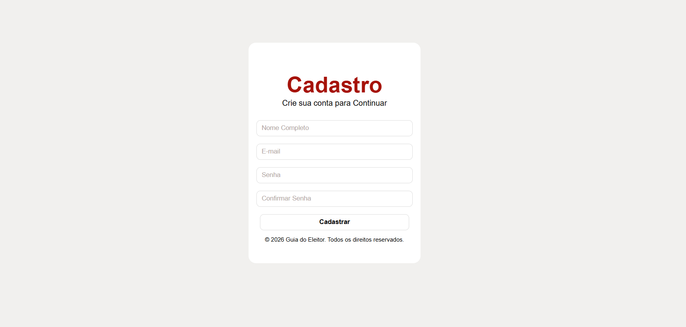

# Formulário de Cadastro

Projeto desenvolvido para praticar os fundamentos de HTML5 e CSS3, reproduzindo uma interface de cadastro a partir de uma referência visual.

## Tecnologias utilizadas
- HTML5 — Estrutura da página e campos do formulário.
- CSS3 — Estilização, cores, espaçamentos e alinhamento.
- Flexbox — Organização dos elementos.

## Objetivo
Desenvolver habilidades em estruturação HTML e estilização CSS, aplicando conceitos aprendidos durante os estudos de desenvolvimento web.

## Funcionalidades
- Campos de nome, e-mail, senha e confirmação de senha.
- Interface de cadastro estilizada.
- Botão de cadastro visual.

**Observação:** Projeto demonstrativo, sem integração com banco de dados ou funcionalidade de cadastro implementada.

## Prévia do projeto

